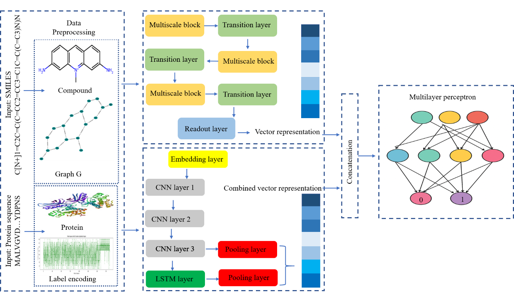

## DeepHybridCPI: A hybrid deep learning framework for compound–protein interaction prediction

### Overview

**DeepHybridCPI** is a hybrid deep learning framework for predicting compound–protein interactions (CPI). It combines:

- **Multiscale Graph Neural Network** for compound feature extraction
- **CNN–LSTM architecture** for protein feature extraction
- **MLP module** for integrating compound and protein embeddings

**Goal:**
Improve accuracy and robustness of CPI prediction


<div align="center">

<br>
</div>


###  Installation & Setup

####  Google Colab (Recommended)

```bash
!pip install torch_geometric
!pip install rdkit
```

#### Train/test DeepHybridCPI:
  
- First, run preprocessing.py using
```bash
  `python preprocessing.py`  
```

- Second, run train.py using
  ```bash
  `python train.py --dataset human --save_model`
   ```

  for Human dataset 

   and
  
  ```bash `
  python train.py --dataset celegans --save_model`
  ```

   for C.elegans dataset


#### Datasets

All data used in this paper are publicly available and can be accessed here: https://github.com/masashitsubaki/CPI_prediction 

###  Citation

If you use DeepHybridCPI in your research, please cite our work: 

"Rasool, A., Rahman, J. U., & Ali, Q. (2026). DeepHybridCPI: A Hybrid Deep Learning Framework for Compound–Protein Interaction Prediction. Journal of Molecular Graphics and Modelling, 109303".
